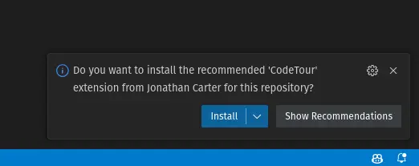
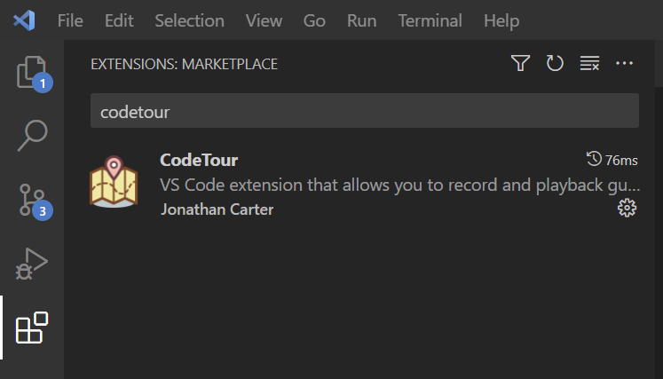
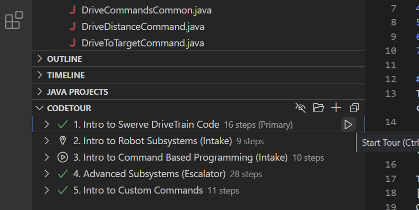

# Java Robot Code for 2023 Kings Park Robot  

This repository contains sample java code for the 2023 robot. It has the following features:
1. Falcon-based swerve drive
2. Limelight-based April tag and Reflective tape vision
3. Raspberry Pi-based game piece vision
4. NEO-based robot elements (intake, escalator)
5. TalonSRX-based robot elements with encoders (elevator) and without encoders (flipper)
6. Path-Planning trajectory commands
7. On-the-fly trajectory generation commands

## Code Tours
To help learn this codebase, code tours are available. These will walk you through the code step-by-step.  
 
Five different code tours are available, each a bit more technologically challenging than the previous one.  

1. Install the code tour extension:

    Either install the recommended extensions:   
      

      

    Or, under extensions, install the 'Code Tour' extension:  

    
    
      

2. Once CodeTour is installed, select the tour from the 'CodeTour' Panel.  
  

  
3. One by one, follow along with each code tour.

